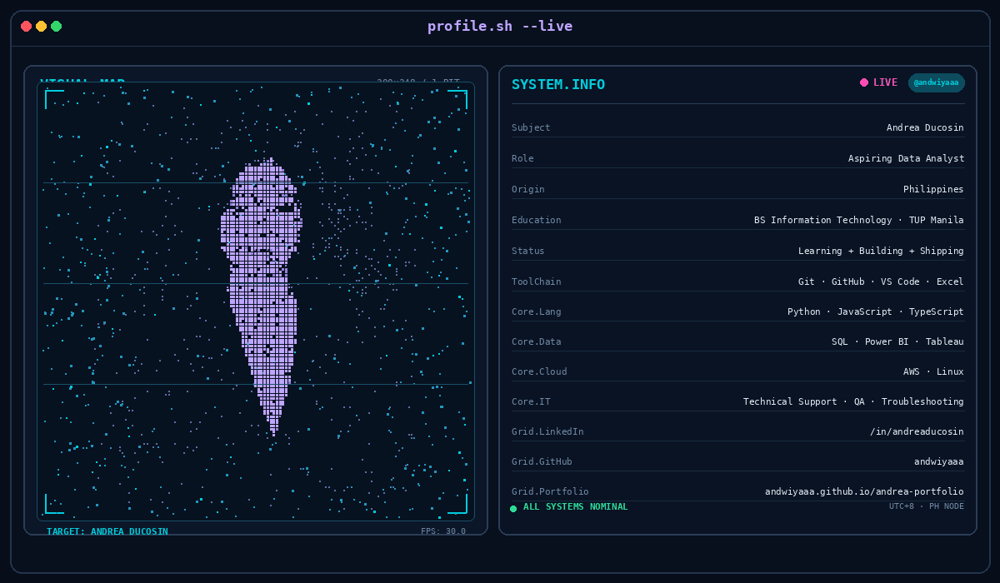

 

  

&nbsp; 
&nbsp; 

  

<code>DATA</code> &nbsp; <code>CLOUD</code> &nbsp; <code>IT SYSTEMS</code>

 

---

## `about.me`

I'm Andrea, an Information Technology graduate exploring the space between **data analytics**, **cloud computing**, and **IT systems**.

I enjoy working with data, understanding how systems work, troubleshooting technical problems, and turning what I learn into useful projects.

- 📊 Data analytics — SQL, Excel, Power BI, Tableau
- ☁️ Cloud — AWS and Linux foundations through AWS re/Start
- 🛠️ IT — technical support, troubleshooting, QA testing, documentation
- 💻 Building — personal projects and a growing technical portfolio

 

---

## `stack.signal`

 

  

 &nbsp;  &nbsp;  &nbsp; 

 

---

## `projects`

### `andwiyaaa/andrea-portfolio`

Personal portfolio showcasing my journey across **data, cloud, and IT**, built with Next.js, React, and TypeScript.

<a href="https://github.com/andwiyaaa/andrea-portfolio">repository</a> &nbsp; · &nbsp; <a href="https://andwiyaaa.github.io/andrea-portfolio/">live portfolio</a>

  

---

profile.sh // personal developer operating system UTC+8 · PH NODE · ALL SYSTEMS NOMINAL

